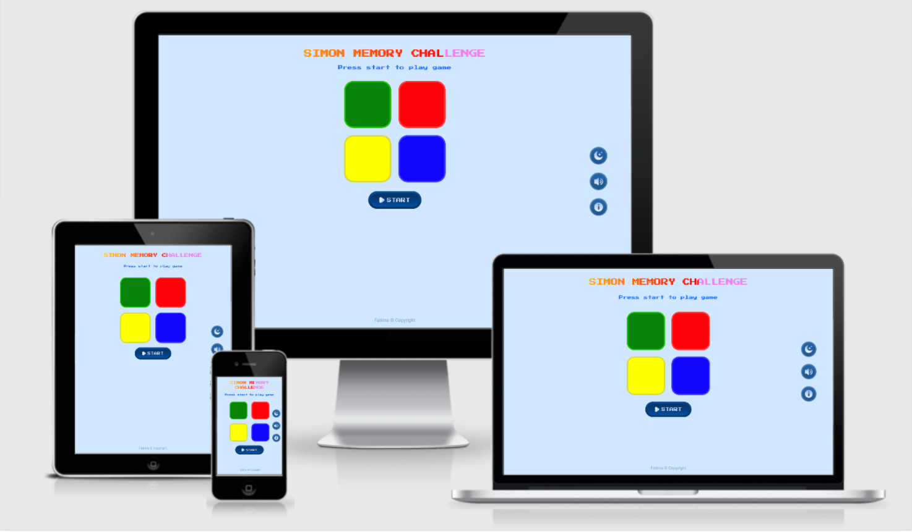

# Simon Memory Challenge

[Simon Memory challenge](https://fatimascoding2020.github.io/Simon-Memory-Challenge/) is an simple interactive memory game.

The Simon Memory Challenge is a memory game designed to engage users of all ages and is child friendly.It is a game with lights and sounds, easy to play, offers various difficulty levels to the user, in which users must replicate a sequence of lights and sounds by pressing the coloured buttons.It features a Start button to start the game sequence and Try Again button will restart the game if the user gets the sequence wrong.This game is fully responsive to the users chosen device.

I have used HTML, CSS and JavaScript to build this and the game which will form part of my ongoing portfolio of work.





## Table of Contents

1. [**UX**](#ux)
    - [**Project goals**](#project-goals) 
    - [**User goals**](#user-goals)
    - [**User Stories**](#user-stories)
    - [**Design choices**](#design-choices)
    - [**Wireframes**](#wireframes)
    
2. [**Technologies Used**](#technologies-used)

3. [**Features**](#features)
    - [**Existing Features**](#existing-features)
    - [**Features To Be Implemented**](#features-to-be-implemented)

4. [**Testing**](#testing)
    - [**Code Validation**](#code-validation)
    
5. [**Deployment**](#deployment)
    - [**To Run Locally**](#to-run-locally)

6. [**Credits**](#credits)
    - [**Sound Effects**](#sound-effects)
    - [**Images**](#images)
    - [**Acknowledgements**](#acknowledgements)

7. [**Disclaimer**](#disclaimer)

## __UX__

### Project goals
The primary goal of Simon Memory Challenge is to provide the user with a simple and fun, easy to use interface.It has different levels of difficulty and is child-friendly.

### User goals

- A fun memory challenge.
- Buttons with lights and sounds.
- Child-friendly fun environment.
- Game controls laid in an intuitive way.
- Dark mode and light mode toggling.
- Sounds on/off button.
- Information on how to play.
- A game for players to practice and improve their memory skills.
- An interactive game with audio and visual stimulus.

### User stories

As a user:

- I want the page to be visually appealing.

- I want to be able to navigate myself around the site with ease and with as little guidance as necessary.

- I want to easily access the game, tutorial information if needed, and control the sounds coming from the website.

- I want to be easily go through difficulty levels of the game and before I play, I have an idea of what will change with each difficulty level.

- I want to be able to restart the game if necessary without having to go back to the home screen to do it.


## Design Choices

The following are the design choices:

**Fonts**

- The main body font **Press Start 2P** was chosen as it is font design from 1980s Namco arcade games.

- The fallback font is **Roboto**.

**Colours**

- The colour choices of buttons are red, blue, green and yellow similar to the original Simon Says game 

**Styling**

- Minimilistic design makes the buttons easy to see when lit. 

**Background**

- Dark mode and light mode toggling according to player choice.

**Audio files**

- Different sounds to help memory.


### Wireframes

I used [Balsamiq](https://balsamiq.com/) for the design and planning process for this project.

#### Desktop view
[Home page](wireframes/Desktop-view/Desktop-view-Simon.png) 
#### Tablet view
[Home page](wireframes/Tablet-view/Tablet-view-Simon.png) 
#### Mobile view
[Home page](wireframes/Mobile-view/Mobile-view-Simon.png) 


## Technologies Used

1. [HTML](https://en.wikipedia.org/wiki/HTML) - This was used for the overall structure of the website.

2. [CSS](https://en.wikipedia.org/wiki/Cascading_Style_Sheets) - This was used for the overall and bespoke styling of elements on the website.

3. [JavaScript](https://en.wikipedia.org/wiki/JavaScript) - This was used to create overall logic of the game as well as controlling the modals, audio and buttons.

4. [Google Fonts](https://fonts.google.com/) - I used Google Fonts Press 2 Play and Roboto.

5. [GitHub](https://github.com/) - I used to store my repository for the project and record all my commits.

6. [GitHub Pages](https://pages.github.com/) - I used to deploy my website.

7. [Atom](https://atom.io/) - I used this to write the code for my site.

8. [Storyblocks](https://www.storyblocks.com/) - I used the game sounds from this website. 

9. [Flaticon](https://www.flaticon.com/) - I used the icons from this website.  


## Features

### Existing Features

1. The user is first greeted with a page with a blinking swipe ”Simon Memory Challenge" title logo and title to Press  Start to play
2. The start button allows the user to start the game.
3. The interactive coloured light-able buttons when clicked have unique sounds which allows the users to replicate a sequence of lights and offers various difficulty levels. 
4. Try Again button will restart the game if the user gets the sequence wrong.
5. The modal “i” button allows users to read the instructions for how to play the game.
6. Users are able to click the volume button, which toggles the sound on and off.The button also changes depending on the toggle state.
7. Users are able to click the dark mode/light mode button, which toggles into dark and light backgrounds.The button also changes depending on the toggle state.


### Features To Be Implemented

**High score**
- I would like to add a high score mode 


## Testing

The testing process can be seen [here](TESTING.md).

### Code Validation

All code written has been thoroughly validated and passed through the following online validators:

- HTML - All code was run through the [W3C HTML Validator](https://validator.w3.org/) to ensure it was valid code and no errors were made.

- CSS - All styling was run through the [W3C CSS Validator](https://jigsaw.w3.org/css-validator/) to ensure it was valid and no errors were made.

- JavaScript - All my script was run through the [JSHint](https://jshint.com/) validator and [Esprima](https://esprima.org/demo/validate.html) and no errors were found.

## Deployment

o deploy this page to GitHub Pages from its [GitHub repository](https://github.com/FatimasCoding2020/Simon-Memory-Challenge), the following steps were taken: 
1. Log into GitHub. 
2. From the list of repositories on the screen, select **USERNAME/REPOSITORY**.
3. From the menu items near the top of the page, select **Settings**.
4. Scroll down to the **GitHub Pages** section.
5. Under **Source** click the drop-down menu labelled **None** and select **Master Branch**
6. On selecting Master Branch the page is automatically refreshed, the website is now deployed. 
7. Scroll back down to the **GitHub Pages** section to retrieve the link to the deployed website.

### Running this project locally

To clone this project from GitHub:
1. Follow this link to the [GitHub repository](https://github.com/FatimasCoding2020/Simon-Memory-Challenge).
2. Under the repository name, click the green "Clone or download" button.
3. In the Clone with HTTPs section, copy the clone URL for the repository. 
4. In your local editor program, open a terminal.
5. Change the current working directory to the location where you want the cloned directory to be made.
6. Type ```git clone```, and then paste the URL you copied in Step 3.

```git clone https://github.com/FatimasCoding2020/Simon-Memory-Challenge```

7. Press Enter. Your local clone will be created.

For more help on cloning a repository on Github, please click [here](https://help.github.com/en/articles/cloning-a-repository).


## Credits

### Sound Effects

- The sound files are sourced from https://www.storyblocks.com/

### Images

- The images are sourced from https://www.flaticon.com/

- The image showing the responsive layouts was created using [Am I Responsive?](http://ami.responsivedesign.is/#).


### Acknowledgements

A special thanks to:

- My Code Institute Mentor, [Precious Ijege](https://github.com/precious-ijege) for his support during the project.


This site has been created entirely for **educational purposes** only and is not intended to be used in any other capacity.This site uses the games concept only to show the developers ability in the language of Javascript.
